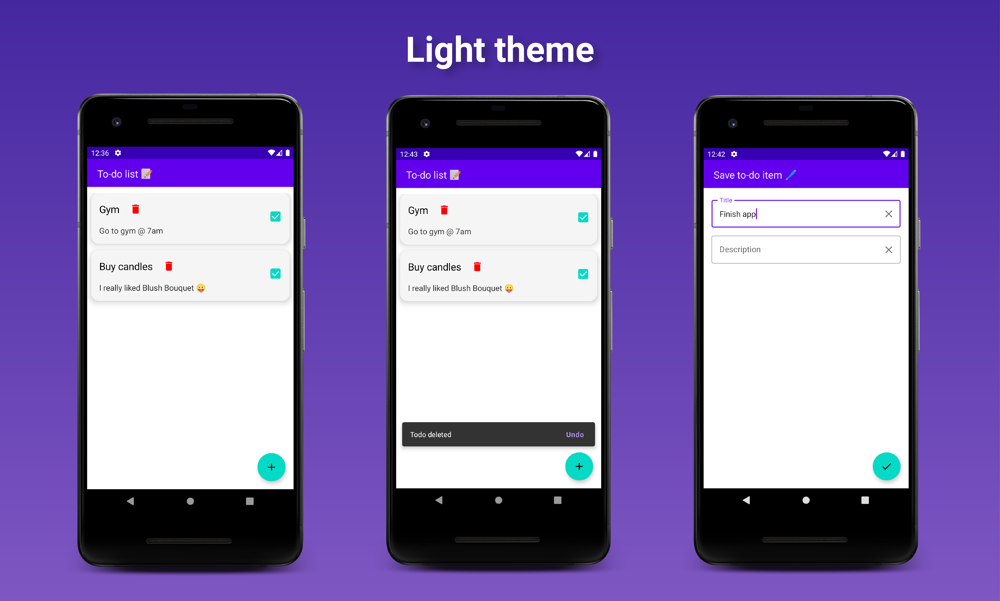
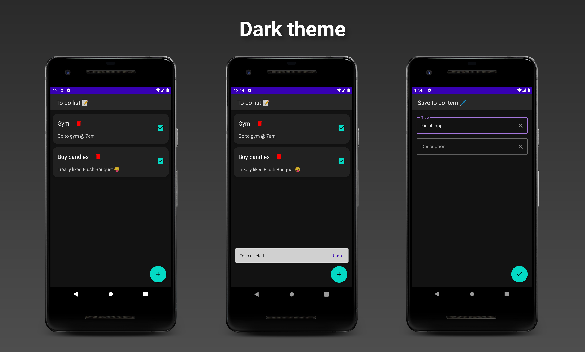

# SimpleTodoApp
Simple TODO app using MVVM architecture with Compose, Room and Dagger Hilt.

## Tech stack
- [Kotlin](https://kotlinlang.org/) with [Coroutines](https://github.com/Kotlin/kotlinx.coroutines)
- [Jetpack Compose](https://developer.android.com/jetpack/compose)
  - [Lifecycle](https://developer.android.com/jetpack/androidx/releases/lifecycle) - manage state of components in response to a change in the lifecycle status of another
  - [Navigation](https://developer.android.com/jetpack/compose/navigation) - navigate between components
- [Hilt](https://dagger.dev/hilt/) - Dagger dependency injection for Android
- [Room](https://developer.android.com/training/data-storage/room) - local persistence

## Architecture
Based on MVVM and repository pattern.

## Light theme

## Dark theme

